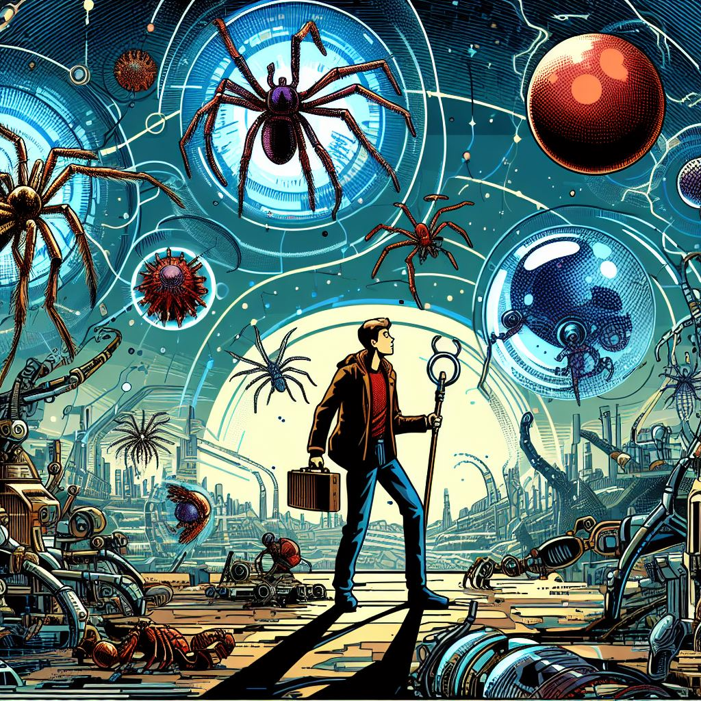

# Приклад прологу для гри

# Таємниця предків

----

Рік 2224. 
Після тріумфальної перемоги над рашизмом, Україна розквітла, перетворившись на могутню й процвітаючу державу.  Ставши членом Євросоюзу та НАТО, вона посіла почесне місце на світовій арені.  Нарешті настала ера миру, що обійняла не лише Україну, але й всю планету.  Майже 200 років людство жило в безтурботній гармонії, насолоджуючись золотим віком.   

----

Однак, ідилія раптово обірвалася.  З глибин землі виринули жахливі апарати прибульців, вивергаючи з себе орди жорстоких арахнідів.  Війна тривала лише півтори години, закінчившись нищівною поразкою людства.  Залізний кулак інопланетних загарбників стиснув планету, позбавивши людей свободи та надії.    

----

Проте, в темряві окупації жевріла іскра віри.  Давня легенда пророкувала появу юнака, якому судилося знайти розрізнені фрагменти цілого, розкривши таємничі знання.  Ці знання стануть ключем до визволення людства й повернення омріяного золотого віку.     

----

## Чи зуміє юнак здійснити пророцтво й дати людству шанс на нове життя? Відповідь на це питання залежить від вас!

### У цій захоплюючій міні-грі вам належить:
* Допомогти юнаку знайти всі частини цілого.
* Розкрити таємничі знання, що дають силу.
* Звести запеклий бій з арахнідами.
* Вирвати людство з пазурів окупантів.
* Повернути мир і процвітання на планету.

## Доля людства в ваших руках!

### 💡[Хочете знати як далі розвивались події?](2024-sample-ending.md)
 

⤴️ [Повернутись до головної сторінки](index.md)