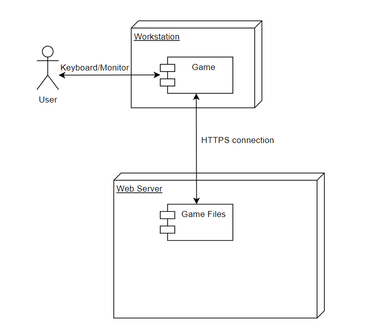

# КОНЦЕПЦІЯ ПРОЕКТУ

Етап: *Аналізу проекту (Envisioning)*

Проект: *Кіберпанк 2069*

Команда: *Професійна єдність новаторських інженерів створювачів*

Виконали:
>*Комельков*

>*Кузьменко*

>*Кіндінов*

>*Луговий*

>*Жеревчук*

>*Головненко*

>*Кражан*

>*Ліфтієв*

>*Кравченко*

>*Деркач*

## **1. НЕОБХІДНІСТЬ ПРОЕКТУ**

Ітеративний підхід до процесу розробки (характерний для MSF) вимагає використання гнучкого способу ведення документації - *живі документи (living documents)* мають змінюватися в ході еволюції проекту. Такий підхід істотно відрізняється від принципів ведення документації каскадної моделі, де процес розробки починається лише після того, як будуть готові і зафіксовані всі вимоги і специфікації.

Документація проектів MSF, як і їх програмний код, створюється ітеративно. На *фазі створення концепції (аналізу)* плани мають форму опису високорівневих *підходів* і в процесі підготовки поширюються серед членів проектної групи та інших зацікавлених осіб для отримання відгуків. 

Наприклад, підхід до тестування може бути коротко сформульований під час фази аналізу, а його перетворення в план тестування відбувається на пізніх фазах. Після переходу до *фази планування* документи поступово допрацьовуються, виникають детальні плани які знову надходять на перевірку всіма зацікавленими сторонами, і описаний процес повторюється ітеративно. Типи планів і загальна кількість документів, які їх описують, можуть змінюватись від проекту до проекту

### **1.1. Обгрунтування необхідності**

Головна мета проекту - залучення уваги та зацікавлення цільової аудиторії спеціальністю "Розробка програмного забезпечення". Мова йде про абітурієнтів та батьків, які можуть бути зацікавлені в освітній програмі для своїх дітей. Також проект спрямований на створення позитивного образу спеціальності через вигадливу та цікаву інтерактивну гру. Це допоможе підвищити  привабливість та репутацію спеціальності серед потенційних студентів.

### **1.2. Бачення проекту**

*Бачення (vision)* - це нічим не обмежене уявлення про те, яким має бути рішення (solution). Бачення проекту спрямоване на формування єдиного розуміння концепції проекту всіма залученими сторонами. 

Формулювання бачення або *vision statement* має бути досить коротким для запам'ятовування, досить ясним для розуміння і досить сильним для мотивації. Коректне формулювання бачення відповідає п'яти характеристикам SMART:

- **Specific** (визначеність / конкретність) - бачення чітко вказує на той (ідеальний) стан, досягнення якого є метою проекту
- **Measurable** (вимірюваність) - дає проектній групі чіткий критерій успішності проекту і досягнення поставлених цілей
- **Achievable** (досяжність) - цілі, сформульовані в баченні, мають бути досяжні в рамках наявних ресурсів, часу і можливостей команди. Досяжність мотивує команду на виконання проекту.
- **Relevant** (обгрунтованість) - цілі, сформульовані в баченні, повинні мати істотне значення для зацікавлених сторін і безпосередньо бути пов'язаними з їх проблемами та/або потребами.
- **Time-based** (обмеженість у часі) - бачення має чітко вказувати на очікувані часові рамки, в які рішення буде створене.

Наш проект - це розробка онлайн екшен-гри в стилі кіберпанк з видом зверху, доступна у браузері з будь-якого пристрою, спрямована на отримання позитивного ігрового досвіду, та має на меті рекламу спеціальності "Розробка ПЗ".

### **1.3. Аналіз вигод**

- Абітурієнти
  - цікава та проста гра, якою можна насолоджуватись будь-де
  - отримання інформації про спеціальність "Розробка ПЗ"
- Батьки
  - впевненість у правильному виборі навчального закладу для своїх дітей
  - збільшення довіри до спеціальності - "якщо там вчать робити таке, то й мого навчать"
- Викладачі та адміністрація 
  - збільшення інтересу абітурієнтів до спеціальності
  - реклама спеціальності на наочному прикладі гри, створеної студентами
  - підвищення репутації спеціальності, її конкурентоспроможності
 
## **2. КОНЦЕПЦІЯ РІШЕННЯ**

*Концепція рішення* (solution concept) надає загальний опис підходів, які проектна група планує використовувати для вирішення проблем та/або задоволення вимог зацікавлених сторін.

### **2.1. Цілі та Завдання**
Формування концепції рішення починається зі з'ясування, опису та фіксації проектною групою цілей проекту. Далі кожна мета розбивається на вимірювані компоненти - *завдання*.

Основні цілі проекту - створення іммерсивного та захоплюючого ігрового досвіду з метою реклами спеціальності. Нижче подано прикладні завдання, які можуть допомогти досягти цих цілей:
- Створення унікального кіберпанк світу:
  - Розробка містичних та технологічних локацій
- Створення атмосфери майбутнього з елементами сучасного
- Глибокий сюжет та персонажі:
   - Розробка захоплюючого сюжету з неочікуваними поворотами
- Створення цікавих та запам'ятовуваних персонажів з власними історіями та мотиваціями
- Інноваційна геймплейна механіка:
   - Впровадження елементів кібернетики та технологій майбутнього
- Реалістична інтерактивність та свобода дій
- Графічне та аудіо враження:
   - Створення вражаючого кіберпанк арту та атмосферного звукового супроводу
- Використання спеціальних ефектів та музичного супроводу для підсилення іммерсії
- Мультиплатформенність та доступність:
   - Розробка браузерної гри, що зробить її доступною для різних платформ (PC, консолі, мобільні пристрої)
-Забезпечення оптимальної продуктивності та геймплею на різних пристроях
Забезпечення підтримки та оновлень для зацікавленої аудиторії

### **2.2. Припущення і Обмеження**
У процесі формування концепції проектна група постійно взаємодіє з зацікавленими сторонами, збираючи необхідну інформацію про вимоги до функціональності майбутнього рішення. Однак, неминуча *неповнота інформації* призводить до того, що стосовно деяких функціональних можливостей рішення можуть знадобитися *припущення* (assumptions). 

Крім функціональних вимог зацікавлені сторони можуть висувати якісні (нефункціональні) вимоги, які задають *обмеження* створюваного рішення. Також *обмеження можуть породжуватись середовищем*, в якому повинно буде функціонувати рішення після впровадження.

**Основні припущення**

- Графічне відображення та інтерфейс:
   - Гра буде мати 2D-графіку та вигляд зверху для гравця
   - Інтерфейс гри максимально простий та зручний для гравця 
- Управління героєм:
   - Герой буде керуватися клавішами W, A, S, D
- Ігрове середовище:
   - Гравець буде рухатися та взаємодіяти з ігровим середовищем у вигляді міста чи локації в стилі кіберпанку
- Без бекенду:
   - Гра буде повністю реалізована на стороні клієнта без необхідності серверного бекенду для зберігання гравців чи гри в цілому
- Оновлення гри:
   - Оновлення гри будуть завантажуватися автоматично після перезапуску сторінки

**Основні обмеження**

- Графічні обмеження:
   - Графічні можливості браузерів є обмеженими, плюс, клієнтський характер гри теж змушує обмежетись простою 2D-графікою 
 - Технічні обмеження браузера:
   - Гра має працювати на різних браузерах без проблем, припускаючи, що користувачі мають сучасні браузери з базовою підтримкою HTML5 та JavaScript.
- Можливості сервера:
   - Не буде використовуватися серверний бекенд для зберігання даних гри або користувачів, оскільки GitHub Pages не підтримують серверний код
- Оптимізація продуктивності:
   - Гра має бути оптимізованою й працювати навіть на пристроях з обмеженими ресурсами

### **2.3. Аналіз використання**
Основою формулювання вимог є аналіз використання, що включає визначення *користувачів* (users) і опис того, як користувачі будуть *взаємодіяти* з рішенням.

#### КОРИСТУВАЧІ

У розробці рішення зацікавлені безліч сторін, проте безпосередньо  з ним будуть працювати саме користувачі, тому перш ніж починати проектування рішення, необхідно визначити, хто буде з ним взаємодіяти.

В процесі аналізу мають бути виділені *групи користувачів* (наприклад, на основі галузей їх діяльності, в яких використовуватиметься рішення, що розробляється).

З нашою грою будуть взаємодіяти такі групи користувачів:
 - Викладачі (в тому числі й голова ЦК)
 - Адміністрація коледжу (заступник директора з навчальної роботи, завідувач відділеня)
 - Абітурієнти (гравці)
 - Відвідувачі сайту колледжу (гравці)

#### СЦЕНАРІЇ ВИКОРИСТАННЯ

*Сценарії використання* (usage scenarios або *прецеденти*) визначають послідовності дій, які користувачі виконують при взаємодії з рішенням. MSF не змушує використовувати конкретні способи опису сценаріїв використання, однак містить рекомендації стосовно використання мови UML (*діаграма прецедентів*) - це один з можливих і досить поширених варіантів.

Сценарії взаємодії гравців з нашим продуктом:
- Старт гри та навігація:
  - Користувач відкриває гру у своєму браузері.
  - Він/вона переходить на головне меню гри, де можна вибрати рівень складності або режим гри.
  - Користувач вибирає рівень або режим гри і починає грати.
- Гра в процесі:
  - Користувач виконує завдання, взаємодіє з NPC, піднімає предмети, бореться з ворогом, рухається по локації, взаємодіє з об'єктами.
  - Ворог рухається по локації, взаємодіє з об'єктами, нападає на персонажа, охороняє предмети.
  - NPC видає завдання.
  - Під час гри користувач може отримувати відомості про свій прогрес, наприклад, кількість очок, час гри тощо.

Прецеденти для нашого продукту зображені на діаграмі:
[Діаграма прецедентів](/docs/1.Envisioning/assets/ДіаграмаПрецедентів.png)

❗А де самі сценарії? Діаграму теж так і не виправили!!!

### **2.4. Вимоги**
Вимоги (requirements) визначають, що має робити рішення, яке ви розробляєте (які послуги надавати користувачам). Вимоги можуть бути описані в термінах *функціональності* або у вигляді правил і параметрів, які визначають функціональність.

#### ВИМОГИ КОРИСТУВАЧІВ

Основні вимоги до функціональності проекту зі створення екшен-гри з видом зверху: 
- Можливість грати в гру без необхідності завантаження або встановлення додаткових програм.
- Інтуїтивний і простий інтерфейс користувача
- Швидке завантаження сторінки

#### СИСТЕМНІ ВИМОГИ

Системні вимоги до продукту: 
- Сумісність з основними веб-браузерами (Chrome, Opera, Firefox тощо)
- Можливість доступу до гри з будь-якого пристрою, який має підключення до Інтернету
- Низькі системні вимоги

### **2.5. Рамки**
Рамки (scope) визначають *параметри* створюваного рішення, деталізуючи функціональність, визначаючи, що залишиться за рамками рішення і вказуючи *критерії*, за якими зацікавлені особи будуть судити про готовність рішення. Рамки створюються на основі *єдиного бачення*, є результатом *компромісу між сформульованими цілями та умовами реальності* і відображають *пріоритезацію замовником наявних вимог* до створюваного рішенням. Частиною процесу визначення рамок проекту є винесення не надто важливої функціональності з поточного проекту в плани на майбутнє.

*Рамки рішення* (solution scope) визначають *функціональність* рішення і його можливості (включаючи ті, що не стосуються програмного забезпечення). Можливість (функціональність, складова, *feature*) - це необхідний або бажаний аспект програмного або апаратного забезпечення. 

Наприклад, попередній перегляд перед друком може бути можливістю текстового процесора; шифрування поштових повідомлень - можливістю поштової програми. Супровідні документи для користувачів, інтерактивні файли допомоги, операційна документація і навчання персоналу також можуть бути складовими вирішення.

*Рамки проекту* (project scope) визначають *обсяг робіт*, який має бути виконаний проектною групою для надання замовнику всіх елементів, визначених рамками рішення.

*Керування рамками проекту є критичним для його успіху*. MSF пропонує визначати і фіксувати рамки рішення і проекту, використовуючи *трикутник компромісів* і *матрицю компромісів* проекту.

#### ФУНКЦІОНАЛЬНІСТЬ РІШЕННЯ

**Функціональність гри:**

- Екшн-пак: Набір спеціальних атак та прийомів, що можуть бути виконані під час боїв в грі
- Керування: Проста система керування персонажем
- Сюжет: Розвиток сюжету в залежності від виборів та дій гравця
- Інтерактивне середовище: Можливість взаємодії з різноманітними об'єктами та персонажами у віртуальному світі кіберпанку
- АІ: Розвинена система керування ворогами та NPC
- Завдання: Наявність різноманітних завдань або міні-ігор, які необхідно буде виконати гравцю
- Візуальні ефекти та анімація: приєвабливе графічне оформлення та анімації у грі

#### ЗА РАМКАМИ РІШЕННЯ

**З огляду на фіксований термін розробки та обмежені ресурси, команда вирішила винести наступні можливості з функціональності гри в стилі кіберпанку:**

- Кібернетичні модифікації: При докладній кастомізації персонажів, включаючи багатошаровий дизайн одягу, волосся, татуювань тощо, виникає значний обсяг роботи для артистів та програмістів. З метою збереження термінів та високої якості іншої функціональності, ця можливість винесена за рамки поточного проекту.
- Мережева гра: Реалізація мережевої гри в реальному часі потребує значних зусиль та часу для стабілізації та оптимізації. Оскільки це може вплинути на загальну якість гри та призвести до втрати фокусу на інші ключові функції, було вирішено відмовитись від цієї можливісті.

### **2.6. Критерії схвалення рішення**

**Критерії прийняття готовності рішення:**

1. **Реалізація функціональності:**
   - Усі функції, зафіксовані в документації, мають бути успішно реалізовані.
   - Рішення має відповідати всім вимогам, зазначеним у специфікаціях та угодах з замовником.

2. **Якість продукту:**
   - Система має бути стабільною, безпечною і масштабованою
   - Усі виявлені помилки та проблеми мають бути виправлені і перевірені

3. **Документація:**
   - Проектна документація має бути вичерпною та доступною для всіх зацікавлених сторін
   - Документація має містити інструкції щодо встановлення, конфігурації та використання рішення

4. **Тести:**
   - Прототип рішення має успішно пройти всі тести, включаючи модульні, інтеграційні та системні тести
   - Результати тестів мають бути задокументовані та доступні для оцінки

5. **Використання працівниками:**
   - Прототип рішення має бути успішно розгорнутий в середовищі GitHub Pages
   - Працівники коледжу мають доступ до прототипу для використання його в рекламних цілях

6. **Розгортання та використання:**
   - Система має бути успішно розгорнута  та готова до використання користувачами
   - Користувачі мають отримати інформацію стосовно використання системи

7. **Відповідність вимогам:**
   - Рішення має відповідати всім вимогам та очікуванням, встановленим зацікавленими сторонами

8. **Підтримка та майбутнє розвиток:**
   - можливі підтримка та розвиток системи після впровадження
   - майбутні оновлення та розширення функціональності відбувається в рамках дипломного проектування 

9. **Забезпечення швидкості та продуктивності:**
   - Прототип рішення має продемонструвати задовільну швидкість та продуктивність при використанні його користувачами
   - Рішення має бути оптимізоване для роботи з великою кількістю користувачів одночасно.
     
## **3. СТРАТЕГІЇ ПРОЕКТУВАННЯ РІШЕННЯ**
### **3.1. Стратегія архітектурного проектування**

На основі розробленого списку можливостей і функцій формується *стратегія архітектурного проектування* (architectural design strategy), яка описує рішення в цілому. 

Стратегія архітектурного проектування визначає *компоненти* рішення і їх *взаємодію*. Чудовий спосіб опису рішення на цьому етапі - використання ілюструючих діаграм UML (наприклад, **діаграми класів**, **діаграми компонентів**, **діаграма розгортання** тощо).

загальний архітектурний проект рішення.
### Діаграма класів:

### Діаграма розгортання:

### **3.2. Стратегія технологічного проектування**

Розробка рішення потребує використання певних *програмних продуктів, бібліотек, фреймворків, технологій*. 

Стратегія технологічного проектування (technical design strategy) описує, які технології і програмні продукти були обрані проектною групою у якості засобу реалізації рішення.

В ході роботи над системою будуть використані наступні *програмні продукти, бібліотеки та технології*:
- Мова програмування С#/html:
- Godot Engine: Це відкрите та безкоштовне інтегроване середовище розробки для створення ігор.
- Графічні редактори: Для створення графічних ресурсів, таких як персонажі, об'єкти та фони шляхом малювання або редагування вже готових можна використовувати такі програми як Paint.NET та Krita 
- Аудіо редактор: Для створення та редагування аудіо ефектів та музики в грі можна використовувати аудіо редактори, такі як Audacity або LMMS.
- Більша частина всього, що буде використовуватись при розробці - це інструменти, які надає сам Godot Engine

---

- [X] *Жеревчук*
- [X] *Комельков*
- [X] *Кузьменко*
- [X] *Кіндінов*
- [X] *Луговий*
- [X] *Головненко*
- [X] *Кражан*
- [x] *Ліфтієв*
- [x] *Кравченко*
- [X] *Деркач*

---
[:arrow_up: Повернутись до початку етапу](/docs/1.Envisioning/README.md)
