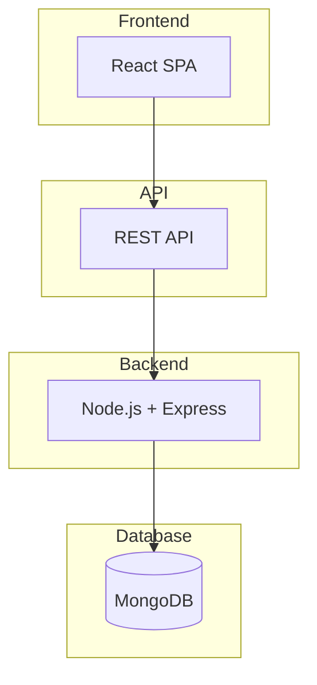

# ФУНКЦІОНАЛЬНА СПЕЦИФІКАЦІЯ

Етап: *Планування (Planning)*

Проект: *NotatkaHUB*

Команда: *СВАРЩИКИ*

Виконали:
>*Павлій Софія*

>*Ватутіна Дарина*

>*Абоімов Владислав*

>*Рубан Олексій*

## **ВСТУП**

Функціональна специфікація - це набір технічних документів, які детально описують кожен елемент рішення, яке створюється. 

## **1. БАЧЕННЯ І РАМКИ**

Інформація стосовно бачення/рамок проекту має концентрувати увагу читача на *ключових елементах* рішення. Ця інформація - стратегічний елемент рішення - те, що необхідно зрозуміти перш ніж починати вникати в деталі функціональної специфікації. Надання цієї інформації формує *загальне бачення проекту* та *загальні очікування* від його реалізації.

Протягом одного місяця розробити клієнтський веб-застосунок для створення та збереження Markdown-нотаток з автозбереженням і експортом у форматі .md, який працює у браузері без встановлення додаткового ПЗ.

**Рамки**
**Функціональність рішення**

- створення, редагування, перегляд, видалення нотаток;

- автозбереження;

- Markdown-підтримка;

- експорт .md (однієї або всіх нотаток);

- адаптивність;

- світла/темна тема;

- перемикання режиму редагування кнопкою з іконкою олівця;
  
- реєстрація та авторизація;

**За рамками рішення**

- теги;

- пошук по нотатках;

- сортування та фільтрація;

- функція «закріпити» нотатку;

- імпорт нотаток (можливе розширення);

- drag-and-drop;

- налаштування шрифтів;

- експорт у PDF або TXT;

## **2. ІСТОРІЯ ПРОЕКТУ**

Розділ «Історія проекту» перераховує *ключові події* в процесі створення рішення в хронологічній послідовності, так, як їх бачить команда. Перераховуються важливі прийняті рішення. 

Ця інформація може виявитися корисною для оцінки того, чи проект був успішним (або, навпаки, провальним) і чому. Подібний аналіз буде вкрай корисним під час створення подібних рішень в майбутньому.

>*23.02.2026* - Початок проекту. Формування проектної групи. Розподіл ролей.
>
>*23.02.2026 - 27.02.2026* - Підготовка та проведення інтерв'ю з замовником. Оформлення протоколу та затвердження його замовником.
>
>*02.03.2026* - Розробка анкети та аналіз результатів. Розробка концепції та структури проектів.
>
>*03.03.2026* -  Побудова діаграми прецедентів.
>
>*04.03.2026* - Аналіз ризиків в проекті.
>
>*06.03.2026* - Форматування плану керування ризиками. Проведення інтерв'ю з замовником. 
>
>*07.03.2026* - Побудова діаграм класів
>
>*10.03.20226* - Створення прототипу інтерфейсу користувача. Вибір моделі розробки
>
>*12.03.2026* - Планування методів тестування
>
>*13.03.2026 - 20.03.2026* - Написання коду
>
>*13.03.2026 - 15.03.2026* - Розробка інтерфейсу користувача.
>
>*16.03.2026* - Форматування зведеного плану проекту.
>
>*20.03.2026* - Написання довідки з використання програми.
>
>*21.03.2026* - Написання функціональної специфікації
>
>*21.03.2026* - Специфікація та сценарії тесту. Опис методів тестування
>
>*22.03.2026* - Тестування та звіт про помилки.
>
>*23.03.2026* - Звіт про пілотне впровадження
>
>*24.03.2026* - Створення анкети відгуку
>
>*25.03.2026* - Звіт про завершення роботи.
>
>*26.03.2026* - Постпроектний аналіз
>
>*28.03.2026* - Презентація проекту/ продукту/ команди

## **3. ЦІЛІ ДИЗАЙНУ**

 Цей розділ документу узагальнює виконаний раніше аналіз вимог. Формулюються *вимоги з точки зору замовника, користувачів, апаратного та програмного оточення*. 
 
 Всі ці вимоги були сформульовані раніше в загальному вигляді, й мають  бути скориговані у *вимоги до рішення та його окремих компонентів в термінах команди розробників*. В результаті відбувається уточнення цілей проекту, сформульованих раніше в його баченні/рамках.

### **3.1.Вимоги користувача**

- CRUD-операції для нотаток;
  
- автозбереження;
  
- підтримка Markdown;
  
- кнопка перемикання режиму редагування/перегляду (іконка олівця);
  
- експорт однієї нотатки у `.md`;
  
- пакетний експорт усіх нотаток;
  
- адаптивний інтерфейс;
  
- світла та темна тема;
  
- реєстрація користувача;
  
- авторизація користувача;
 
- збереження нотаток у персональному акаунті.

### **3.2. Системні вимоги**

**Системні вимоги**

- робота у сучасних браузерах;
  
- серверна частина для обробки запитів (backend);
  
- збереження даних у базі даних **MongoDB**;
  
- використання REST API для взаємодії клієнта і сервера;
  
- можливість розгортання клієнтської частини на **GitHub Vercel**, а серверної частини на **хмарному сервері**;
  
- мінімальні апаратні вимоги (будь-який пристрій із браузером та доступом до Інтернету).

### **3.3. Сценарії використання**

**Групи користувачів**

- Студенти

- Викладачі

- Користувачі для особистих нотаток

**Основні сценарії використання**

- Створення нової нотатки

- Автоматичне збереження при редагуванні

- Перемикання між режимом редагування та перегляду

- Видалення нотатки

- Експорт окремої нотатки

- Експорт усіх нотаток

- Перемикання світлої/темної теми

## **4. ВИКЛЮЧЕНІ МОЖЛИВОСТІ Й НЕПІДТРИМУВАНІ СЦЕНАРІЇ**

В цьому розділі передбачається перелік *​​вимог, які не знайдуть відображення в поточному релізі* проекту. При цьому мають бути вказані як вимоги користувачів, так і вимоги до апаратного і програмного оточення. Для кожної з вимог, які не планується задовольняти, необхідно навести *обгрунтування* (чому це не робиться). В цій секції можна сформулювати міркування щодо того, *що необхідно зробити в майбутніх релізах*, щоб задовольнити вимогам, і коли (і в якому разі) це може бути зроблено.

Необхідно додатково відзначити важливість даного розділу. В будь-якому випадку важливо чесно описати, яку функціональність ми створюємо. Необхідно всіма силами *уникати недорозуміння сторонами того, про що конкретно вони домовилися*. **Міркування виду «зараз все ОК, а там буде видно» на практиці призводять до катастроф** на завершальних етапах.

**Функціональність рішення**

- створення, редагування, перегляд, видалення нотаток;

- автозбереження;

- Markdown-підтримка;

- експорт .md (однієї або всіх нотаток);

- адаптивність;

- світла/темна тема;

- перемикання режиму редагування кнопкою з іконкою олівця;
  
- реєстрація та авторизація;

**За рамками рішення**

- теги;

- пошук по нотатках;

- сортування та фільтрація;

- функція «закріпити» нотатку;

- імпорт нотаток (можливе розширення);

- drag-and-drop;

- налаштування шрифтів;

- експорт у PDF або TXT;

## **5. ПРИПУЩЕННЯ І ЗАЛЕЖНОСТІ**

Розділ «Припущення і залежності» перераховує і визначає припущення і залежності, орієнтовані на проект і зроблені в рамках створення функціональної специфікації. 

#### Припущення

- користувач працює в сучасному браузері;
  
- користувач має доступ до Інтернету для роботи із застосунком;
  
- автозбереження здійснюється при зміні вмісту;
  
- нотатки зберігаються у базі даних MongoDB;
  
- кожна нотатка прив’язана до конкретного користувача;
  
- користувач повинен зареєструватися або увійти в систему;
  
- теги, сортування, фільтрація не є обов’язковими;
  
- імпорт нотаток може бути реалізований як додаткова функція;
  
- достатньо двох тем (світла/темна).

#### Обмеження

- проект потребує серверної частини (backend);
  
- використовується база даних MongoDB для збереження нотаток;
  
- термін виконання – 1 місяць;
  
- drag-and-drop не реалізується;
  
- налаштування шрифтів та розміру тексту не входить у поточну версію;
  
- експорт здійснюється лише у форматі `.md`;
  
- система авторизації реалізується у базовому вигляді (реєстрація та вхід).

## **6. ПРОЕКТ РІШЕННЯ**

Проект рішення узагальнює документи, створені в рамках проектування майбутнього рішення, в короткій стислій формі. 

При цьому вказуються призначення та важливість для проекту зазначених документів. Ця інформація сприяє виробленню у читача ясного уявлення про концепцію проектування рішення.

### **6.1. Концептуальний проект**

Діаграма прецедентів:

### **Важливі проектні рішення**

- **Реалізація системи у вигляді веб-застосунку**
  - інші варіанти: мобільний або десктопний застосунок
  - **переваги:**
    - незалежність від операційної системи;
    - доступність з будь-якого пристрою з браузером;
    - не потребує встановлення;
    - простіше розгортання та оновлення.
  - **недоліки:**
    - потрібне стабільне Інтернет-з’єднання;
    - залежність від браузера.

---

- **Використання архітектури клієнт-сервер**
  - інші варіанти: повністю клієнтський застосунок (без сервера)
  - **переваги:**
    - централізоване збереження даних;
    - можливість авторизації користувачів;
    - безпечніше зберігання інформації.
  - **недоліки:**
    - необхідність підтримки серверної частини;
    - складніше розгортання.

---

- **Використання SPA (Single Page Application)**
  - інші варіанти: класичний багатосторінковий веб-застосунок
  - **переваги:**
    - швидка робота інтерфейсу;
    - менше перезавантажень сторінок;
    - кращий користувацький досвід.
  - **недоліки:**
    - складніша структура фронтенду;
    - більше логіки на клієнтській стороні.

---

- **Використання Markdown для форматування нотаток**
  - інші варіанти: звичайний текст або HTML-редактор
  - **переваги:**
    - простий синтаксис;
    - можливість структурованого форматування;
    - популярний формат для документації.
  - **недоліки:**
    - користувачеві потрібно знати базовий синтаксис Markdown.

---

- **Реалізація автозбереження нотаток**
  - інші варіанти: ручне збереження
  - **переваги:**
    - зменшення ризику втрати даних;
    - зручність для користувача.
  - **недоліки:**
    - додаткові запити до сервера.

---

- **Використання MongoDB як бази даних**
  - інші варіанти: SQL-бази (PostgreSQL, MySQL)
  - **переваги:**
    - гнучка структура даних;
    - добре підходить для JSON-подібних документів;
    - проста інтеграція з Node.js.
  - **недоліки:**
    - менше жорстких обмежень структури даних.

---

- **Використання JWT для авторизації**
  - інші варіанти: сесійна авторизація
  - **переваги:**
    - зручна робота з REST API;
    - не потребує збереження сесій на сервері;
    - добре масштабується.
  - **недоліки:**
    - потребує правильного налаштування безпеки.

---

- **Розгортання застосунку у хмарі**
  - інші варіанти: локальний сервер
  - **переваги:**
    - доступність з будь-якого місця;
    - автоматичне масштабування;
    - простота деплою.
  - **недоліки:**
    - залежність від хмарних сервісів.

### **6.2. Логічний проект**

Створення *логічного проекту* - наступна стадія в проектуванні рішення. Так, в концептуальному проекті ми показуємо майбутнє рішення в термінах замовника, не залучаючи технології і нічого не кажучи про внутрішню будову. У логічному проекті ми маємо виділити *основні структурні елементи майбутнього рішення*, розібратися з їх *ієрархією, поведінкою, атрибутами, взаємозв'язками*.

В результаті логічного проектування ми маємо отримати *абстрактну модель рішення*. При цьому мова про залучення якихось технологій для реалізації цієї моделі поки не йде.

На етапі логічного проектування можуть бути вирішені наступні важливі завдання:

* *Збір відгуків зацікавлених осіб*. Проаналізувавши їх ми можемо виявити помилки проектування на ранніх стадіях проекту
* Перевірка *відповідності проекту вимогам*
* Створення базису для подальшої розробки *системи тестів*

Застосунок реалізується як клієнт-серверна система з використанням SPA (Single Page Application) для клієнтської частини.

Архітектура системи:

Основні модулі:

**Frontend**

- UI-модуль
- модуль управління нотатками
- Markdown-модуль
- модуль авторизації
- модуль експорту

**Backend**

- API-модуль
- модуль авторизації користувачів
- модуль управління нотатками
- модуль роботи з базою даних (MongoDB)

Взаємодія між клієнтом і сервером відбувається через REST API.
Дані нотаток зберігаються у базі даних MongoDB.

### **6.3. Фізичний проект**

Фізичний проект являє собою *проекцію логічного проекту на наявне апаратне, програмне і технологічне оточення*. 

Так, нам потрібно вибрати ті чи інші *технології* для реалізації ідей, закладених в концептуальному і уточнених в логічному проектуванні. 

Фізичний проект фактично являє собою *документацію з чітким зазначенням параметрів реалізованої функціональності в термінах розробників* програмного забезпечення.

Крім того, вирішуються як *питання створення компонентів*, які допускають повторне використання, так і питання *застосування написаного раніше коду* (або сторонніх розробок).

У проекті буде використано сучасний підхід до розробки SPA-застосунків із використанням бібліотеки React.

**Основні технології:**

**Frontend**

- React - для побудови компонентної архітектури інтерфейсу;
  
- TypeScript - основна мова програмування;
  
- Vite - для ініціалізації та збірки проекту;
  
- CSS Modules/Tailwind - для стилізації;
  
- react-markdown - для обробки Markdown;
  
- React Hooks - для управління станом та автозбереження;

- Tanstack Routes - для легкої маршрутизації між сторінками;
  
- Axios - для взаємодії з сервером.

**Backend**

- Node.js - середовище виконання серверної частини;
  
- Express.js - для створення REST API;
 
- JWT (JSON Web Token) - для авторизації користувачів;
  
- bcrypt - для хешування паролів.

**База даних**

- MongoDB - для збереження нотаток та даних користувачів;
 
- Mongoose - для роботи з MongoDB через моделі.

**Інструменти**

- Git / GitHub - контроль версій;
  
- MongoDB Atlas - хмарна база даних;
  
- Vercel - для розгортання застосунку;
  
- VS Code - середовище розробки.

## **7. ВИМОГИ ДО ІНСТАЛЯЦІЇ І ДЕІНСТАЛЯЦІЇ**

Застосунок буде розгорнуто як клієнт-серверна система.

**Процес релізу:**

- створення production-збірки frontend

- розгортання frontend на Vercel

- розгортання backend на Render

- підключення MongoDB Atlas

- перевірка працездатності

- створення Release на GitHub

## **8. РИЗИКИ**

План для Ризику №3: Помилка підключення до MongoDB
* **Ідентифікатор:** R03
* **Формулювання:** Неправильна конфігурація або збій мережі призводить до неможливості з'єднання з базою даних.
* **Стратегія запобігання:** Використання змінних оточення (ENV) та моніторинг стану підключення при старті сервера.
* **Плановані дії:**
  1. Реалізація механізму повторного підключення (Retry) (до 12.03) - Відповідальний: Абоімов В.П.
  2. Налаштування сповіщень у Telegram про падіння БД (до 18.03) - Відповідальний: Ленко А.Е.
* **Тригер:** Подія `mongoose.connection.on('error')`.
* **Відповідальний:** Абоімов В.П.

---

- [x] *Павлій Софія*
- [x] *Ватутіна Дарина*
- [x] *Абоімов Владислав*
- [x] *Рубан Олексій*

---
[:arrow_up: Повернутись до початку етапу](/docs/2.Planning/README.md)
